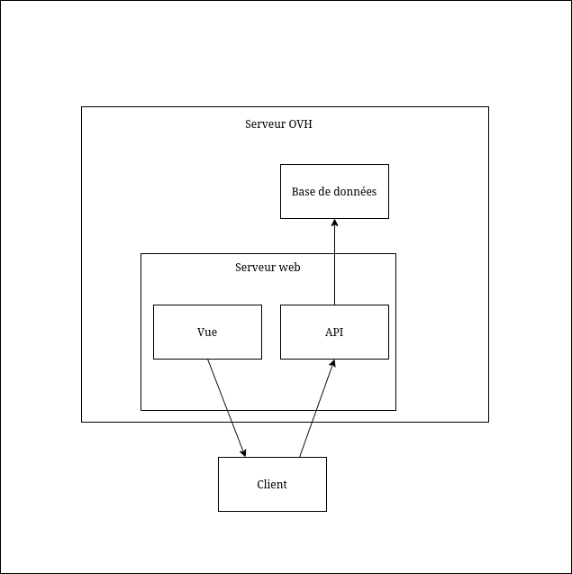

# SAE-5.01-APE-Jules-Ferry
Solution de gestion d'évenements et d'actualités pour l'APE Jules Ferry Anglet.

## 🌐 Contexte

L'APE Jules Ferry a un besoin d'organiser la planification de ses bénévoles sur les différentes tâches d'un événement, ainsi que faciliter la transmission d'informations aux parents d'élèves.

## 🏗️ Architecture du dépôt

Le dépôt `SAE-5.01-APE-Jules-Ferry` contient l'intégralité de l'application. Il est organisé en mono-repo pour maintenir la cohérence des codes entre le front-end et le back-end.

- [Front-end](https://github.com/EtienneDumai/SAE-5.01-APE-Jules-Ferry/tree/master/frontend) 🖥️ : Solution frontend de l'application.
- [Back-end](https://github.com/EtienneDumai/SAE-5.01-APE-Jules-Ferry/tree/master/backend) 🖥️ : Partie backend de l'application.

Chaque partie contient sa documentation spécifique et sa procédure d'installation.

## 🚀 Architecture de la solution et technologies

### Architecture

La solution `APE Jules Ferry` est conçue pour être déployée sur des serveurs GNU/Linux de type Debian. Elle utilise une architecture client-serveur avec communication par API Rest.



## Developper en mode local : 
- Activer l'extension php-pgsql dans le fichier php.ini
- Installer les dépendances du backend :
     ```bash
    cd backend \
    composer install \
    cp .env.example .env \
    php artisan key:generate \
    cd ..  n
    ```
- Installer les dépendances du frontend :
    ```bash
    cd frontend \
    npm install \
    cd ..
    ```
- Lancer l'application en mode developpement avec Docker : 
    ```bash
    docker-compose -f docker-compose.yml up --build
    ```
- Lancer l'application en mode production avec Docker : 
    - Copier le .env actuel dans le fichier .env.prod : 
        ```bash
        cd backend \
        cp .env .env.prod \
        cd ..
        ```
    - Lancer l'application en mode production avec Docker : 
        ```bash
        docker compose -f docker-compose.prod.yml up --build
        ```

## Deployer l'application sur le serveur de production :
- Pré-requis : 
    Avoir une clé ssh sur le serveur car le serveur refuse les connexions ssh par mot de passe
- Connexion au serveur distant
  ```bash
  ssh debian@ADRESSE_SERVEUR
  ```
L'authentification se fera uniquement si la clef ssh a bien été configurée.

